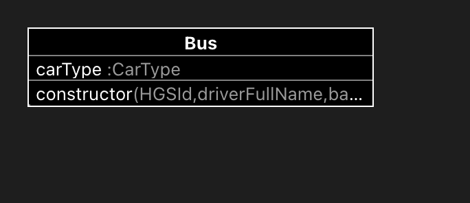

# Case Study for Akbank WEB3 Practium

This project is a case study for Akbank WEB3 Practium. Here is the case;

## Introduction

In the case study, we were given a task to create a basic toll booth applicaton using OOP standards. The task mainly contains creating car instances, charging them with toll booth instances, and reporting them with report instance.

I want to take a step further that task, and instead of creating a console app I wanted to create more visual web app. Since, I am learning new technologies for both backend and frontend, I wanted to use them in this project too.

## Technologies and Tools

Project was created with Create T3 App stack, written in TypeScript, and it contains following technologies:

- React
- Next.js
- tRPC
- TailwindCSS

## How it Works and Using It

- While server is running, existing instances of cars, toll booths and report classes are created and stored in memory. When a user requests a page, tRPC queries returns the data from stored instances to the client.
- In landing page, user can see the list of cars and create new car instances.
- In toll booth page, user can see the list of toll booths and charge a car.
- In report page, user can see the daily revenue of all toll booths.

## Class Diagrams

Stucture of the classes are as follows:

### Car

### Auto

### Minibus

### Bus

### Toll Booth

### Report

## Project Structure

Project structure is as follows:

- src
  - lib
    - car
      - interfaces
        - ICar.d.ts
      - Car.ts
      - Auto.ts
      - Minibus.ts
      - Bus.ts
    - tollBooth
      - interfaces
        - ITollBooth.d.ts
      - TollBooth.ts
    - report
      - interfaces
        - IReport.d.ts
      - Report.ts
  - pages
    - api
      - [trpc].ts
    - \_app.tsx
    - index.tsx
    - report.tsx
    - tollbooth.tsx
  - server
    - router
      - index.ts
      - context.ts
      - report.ts
      - tollBooth.ts
      - car.ts
  - styles
    - global.css
  - utils
    - trpc.ts
